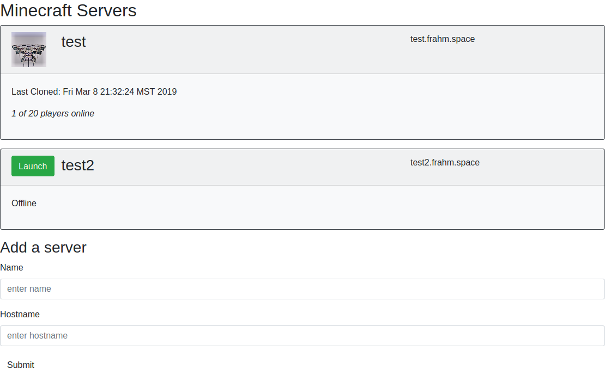

# minecraft-auto-start
AWS Cloud-based minecraft servers that shut down when idle and launch on demand.

This project starts with a UI, where a user can log in, view available servers, and launch the one they want to play on, if it is offline:

Servers are configured with a plugin that will automatically terminate the server they are running on when no players have been online for 15 minutes.

Very much a work in progress - there is much yet to do for this app. See [Issues](https://github.com/jusdino/minecraft-auto-start/issues) to see what I've got in mind next.
